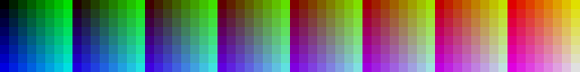

## Sixel images in Javascript.

SIXEL image decoding / encoding library for node and the browser.


### Decoding

For decoding the library provides a stream decoder, that can either be used directly,
or with the following convenient functions:

- `decode(data: UintTypedArray | string, opts?: IDecoderOptions): IDecodeResult`  
    Convenient function to decode the sixel data in `data`. Can be used for casual decoding and when you have the full image data at hand (not chunked). The function is actually a thin wrapper around the decoder, and spawns a new instance for every call.  
    Returns the decoding result as `{width, height, data32}`.

- `decodeAsync(data: UintTypedArray | string, opts?: IDecoderOptions): Promise<IDecodeResult>`  
    Async version of `decode`. Use this one in browser main context.


#### Decoder

The decoder uses webassembly for data decoding (see [/wasm](wasm/) for the webassembly parts).
It exposes the following properties:

- `constructor(opts?: IDecoderOptions)`  
    Creates a new decoder instance. Spawns the internal wasm part synchronously, which will work in nodejs or a web worker context, but not in the main context of all browsers. Use the promisified constructor function `DecoderAsync` there instead.  
    Override default decoder options with `opts`. The options are used as default settings during image decoding and can be further overridden at individual images with `init`.

- `init(fillColor?: RGBA8888, palette?: Uint32Array, paletteLimit?: number, truncate?: boolean)`  
    Initialize the decoder for the next image. This must be called before doing any decoding.  
    The arguments can be used to override decoder default options. if omitted the default options will be used.
    
    The `palette` argument is somewhat special, as it respects a 3-way handling:
    - explicitly set: applies values from your palette
    - set to `undefined`: applies values from default decoder palette
    - set to `null`: no palette changes applied (leaves color registers from previous decoding untouched)

    The `truncate` settings indicates, whether the decoder should limit image dimensions to found raster attributes. While this is not 100% spec-conform, it is what most people would expect and how modern sixel encoder will encode the data. Therefore is set by default.

- `decode(data: UintTypedArray, start: number = 0, end: number = data.length): void`  
    Decode sixel data provided in `data` from `start` to `end` (exclusive). `data` must be a typed array containing single byte values at the index positions.  
    The decoding is stream aware, thus can be fed with chunks of data until all image data was consumed.

- `decodeString(data: string, start: number = 0, end: number = data.length): void`  
    Same as `decode`, but with string data. Do not use this method, if performance matters.

- `release(): void`  
    Release internally held image ressources to free memory. This may be needed after decoding a rather big image consuming a lot of memory. The decoder will not free the memory on its own, instead tries to re-use ressources for the next image by default. Also see below about memory handling.

- `data32: Uint32Array`  
    Getter of the pixel data as 32-bit data (RGBA8888). The pixel array will always be sized as full image of the currently reported `width` and `height` dimensions (with `fillColor` applied). Note that the array is only borrowed in most cases and you may want to copy it before doing further processing.  
    It is possible to grab the pixels of partially transmitted images during chunk decoding. Here image dimensions may not be final yet and keep shifting until all data was processed.

- `data8: Uint8ClampedArray`  
    Getter of the pixel data as 8-bit channel array, e.g. for direct usage at the `ImageData` constructor.
    The getter refers internally to `data32`, thus exhibits the same dimension and borrow mechanics.

- `width: number` 
    Reports the current width of the current image. For `truncate=true` this may report the raster width, if a valid raster attribute was found. Otherwise reports rightmost band cursor advance seen so far. 

- `height: number`  
    Reports the current height of the current image. Note that for `trancate=true` this may report the raster height, if a valid raster attribute was found. Otherwise reports the lowermost pixel position touched by a sixel.

- `memoryUsage: number`  
    Reports the current memory usage of the decoder for wasm module memory and allocated pixel buffer.

- `properties: IDecoderProperties`  
    Reports various properties of the current decoder state.

- `palette: Uint32Array`  
    Returns the currently loaded palette (borrowed).


### Encoding

For encoding the library provides the following properties:

- `image2sixel(data: Uint8Array | Uint8ClampedArray, width: number, height: number, maxColors: number = 256,backgroundSelect: 0 | 1 | 2 = 0): string`  
    Convenient function to create a full SIXEL escape sequence for given image data (note this is still alpha).

    Quantization is done by the internal quantizer, with dithering on 4 neighboring pixels for speed reasons, which works great for real pictures to level out hard color plane borders, but might show moiré or striping artefacts on color gradients. Currently the dithering is not configurable, resort to custom quantizer library in conjunction with `sixelEncode` if you observe dithering issues.

- `sixelEncode(data: Uint8ClampedArray | Uint8Array, width: number, height: number, palette: RGBA8888[] | RGBColor[], rasterAttributes: boolean = true): string`  
    Encodes pixel data to a SIXEL string. `data` should be an array like type with RGBA pixel data. `width` and `height` must contain the pixel dimension of `data`. `palette` should contain the used colors in `data` and must not be empty. To avoid poor output quality consider using a quantizer with dithering and palette creation before converting to SIXEL. See `node_example_encode.js` for an example usage in conjunction with `rgbquant`.
    For transparency only an alpha value of 0 will be respected as fully transparent, other alpha values are set to fully opaque (255). Transparent pixels will be colored by the terminal later on depending on the `backgroundSelect` setting of the introducer.  
    Note: Some terminals have strict palette limitations, in general the palette should not contain more than 256 colors.

- `introducer(backgroundSelect: number = 0): string`  
    Creates the escape sequence introducer for a SIXEL data stream.
    This should be written to the terminal before any SIXEL data.  
    `backgroundSelect` is a hint for the terminal how to deal with uncolored pixels:

    - 0 - device default action (most terminals will apply background color)
    - 1 - no action (previous pixel value at output position should remain)
    - 2 - set to background color (device dependent)

- `FINALIZER: string`  
    Finalizes the SIXEL escape sequence. Write this, when the SIXEL data stream has ended.
    Note that a SIXEL escape sequences changes the operation mode of a terminal,
    forgetting the finalizer might leave the terminal in an unrecoverable state.


### Convenient Properties

Furthermore the library exposes some general purpose properties:

- `function toRGBA8888(r: number, g: number, b: number, a: number = 255): RGBA8888`  
    Converts the RGBA channel values to the native color type `RGBA8888`.

- `function fromRGBA8888(color: RGBA8888): number[]`  
    Converts the native color to an array of [r, g, b, a].

- `PALETTE_VT340_COLOR: Uint32Array`  
    16 color palette of VT340 (as `RGBA8888`).

- `PALETTE_VT340_GREY: Uint32Array`  
    16 monochrome palette of VT340 (as `RGBA8888`).

- `PALETTE_ANSI_256: Uint32Array`  
    256 ANSI color palette derived from xterm (as `RGBA8888`).


### Installation
Install the library with `npm install sixel`.

For direct usage in the browser, see under "browser bundles" below.


### Examples and browser demo
See the example files in `/examples` for decoding/encoding in nodejs. Note that the examples and the
browser demo are not part of the npm package, clone the repo and run `npm install` if you want to see them in action.

Decoding can also be tested in the browser after `npm start` under `localhost:8080`.

Encoding can be tested in a SIXEL capable terminal with `img2sixel.js`, e.g.
```
$> node img2sixel.js -p16 http://leeoniya.github.io/RgbQuant.js/demo/img/bluff.jpg
```


### Benchmarks
Performance is measured for typical actions based on 9-bit palette image:


The test image repeats the palette image 6 times to form a 640x480 image with 512 colors. The unusual (and not spec conform) high number of colors was chosen to explicit test for this as an upper bound.

Results:
```
   Context "lib/index.benchmark.js"
      Context "testimage"
         Context "decode"
            Case "decode" : 20 runs - average runtime: 0.77 ms
            Case "decodeString" : 20 runs - average runtime: 1.76 ms
         Context "encode"
            Case "sixelEncode" : 20 runs - average runtime: 21.52 ms
      Context "decode - testfiles"
         Case "test1_clean.sixel" : 20 runs - average runtime: 4.36 ms
         Case "test1_clean.sixel" : 20 runs - average throughput: 144.83 MB/s
         Case "test2_clean.sixel" : 20 runs - average runtime: 1.96 ms
         Case "test2_clean.sixel" : 20 runs - average throughput: 161.27 MB/s
         Case "sampsa_reencoded_clean.six" : 20 runs - average runtime: 4.36 ms
         Case "sampsa_reencoded_clean.six" : 20 runs - average throughput: 148.78 MB/s
         Case "FullHD 12bit noise" : 20 runs - average runtime: 50.70 ms
         Case "FullHD 12bit noise" : 20 runs - average throughput: 306.03 MB/s
         Case "640x480 9bit tiles" : 20 runs - average runtime: 0.68 ms
         Case "640x480 9bit tiles" : 20 runs - average throughput: 148.33 MB/s
```


### Decoder usage

For casual usage and when you have the full image data at hand,
you can use the convenient functions `decode` or `decodeAsync`.

_Example (Typescript):_
```typescript
import { decode, decodeAsync, IDecoderOptions } from 'sixel';

// some options
const OPTIONS: IDecoderOptions = {
    memoryLimit: 65536 * 256, // limit pixel memory to 16 MB (2048 x 2048 pixels)
    ...
};

// in nodejs or web worker context
const result = decode(some_data, OPTIONS);
someRawImageAction(result.data32, result.width, result.height);

// in browser main context
decodeAsync(some_data, OPTIONS)
  .then(result => someRawImageAction(result.data32, result.width, result.height));
```

These functions are much easier to use than the stream decoder,
but come with a performance penalty of ~25% due to bootstrapping into
the wasm module everytime. Do not use them, if you have multiple images to decode.
Also they cannot be used for chunked data.

For more advanced use cases with multiple images or chunked data,
use the stream decoder directly.

_Example (Typescript):_
```typescript
import { Decoder, DecoderAsync, IDecoderOptions } from 'sixel';

// some options
const OPTIONS: IDecoderOptions = {
    memoryLimit: 65536 * 256, // limit pixel memory to 16 MB (2048 x 2048 pixels)
    ...
};

// in nodejs or web worker context
const decoder = new Decoder(OPTIONS);
// in browser main context
const decoderPromise = DecoderAsync(OPTIONS).then(decoder => ...);

// and later on:
for (image of images) {
    // initialize for next image with defaults
    // for a more terminal like behavior you may want to override default settings
    // with init arguments, e.g. set fillColor to BG color / reflect palette changes
    decoder.init();

    // for every incoming chunk call decode
    for (chunk of image.data_chunks) {
        decoder.decode(chunk);
        // optional: check your memory limits
        if (decoder.memoryUsage > YOUR_LIMIT) {
            // the decoder is meant to be resilient for exceptional conditions
            // and can be re-used after calling .release (if not, please file a bug)
            // (for simplicity example exits whole loop)
            decoder.release();
            throw new Error('dont like your data, way too big');
        }
        // optional: grab partial data (useful for slow transmission)
        somePartialRawImageAction(decoder.data32, decoder.width, decoder.height);
    }

    // image finished, grab pixels and dimensions
    someRawImageAction(decoder.data32, decoder.width, decoder.height);

    // optional: release held pixel memory
    decoder.release();
}
```


__Note on decoder memory handling__

The examples above all contain some sort of memory limit notions. This is needed,
because sixel image data does not strictly announce dimensions upfront,
instead incoming data may implicitly expand image dimensions. While the decoder already
limits the max width of an image with a compile time setting,
there is no good way to limit the height of an image (can run "forever").

To not run into out of memory issues the decoder respects an upper memory limit for the pixel array.
The default limit is set rather high (hardcoded to 128 MB) and can be adjusted in the decoder options
as `memoryLimit` in bytes. You should always adjust that value to your needs.

During chunk decoding the memory usage can be further tracked with `memoryUsage`. Other than `memoryLimit`,
this value also accounts the static memory taken by the wasm instance, thus is slightly higher and
closer to the real usage of the decoder. Note that the decoder will try to pre-allocate the pixel array,
if it can derive the dimensions early, thus `memoryUsage` might not change anymore for subsequent
chunks after an initial jump. If re-allocation is needed during decoding, the decoder will hold up to twice
of `memoryLimit` for a short amount of time.

During decoding the decoder will throw an error, if the needed pixel memory exceeds `memoryLimit`.

Between multiple images the decoder will not free the pixel memory of the previous image.
This is an optimization to lower allocation and GC pressure.
Call `release` after decoding to explicitly free the pixel memory.

Rules of thumb regarding memory:
- set `memoryLimit` to a more realistic value, e.g. 64MB for 4096 x 4096 pixels
- conditionally call `release` after image decoding, e.g. check if  `memoryUsage` stays within your expectations
- under memory pressure set `memoryLimit` rather low, always call `release`


### Package format and browser bundles

The node package comes as CommonJS and can be used as usual.
An ESM package version for nodejs is planned for a later release.

For easier usage in the browser the package contains several prebuilt bundles under `/dist`:
- decode - color functions, default palettes and decoder
- encode - color functions, default palettes and encoder
- full - full package containing all definitions.

The browser bundles come in UMD and ESM flavors. At the current stage the ESM builds are mostly untested (treat them as alpha, bug reports are more than welcome). Note that the UMD bundles export the symbols under the name `sixel`.

Some usage examples:
- vanilla usage with UMD version:
  ```html
  <script nomodule src="/path/to/decode.umd.js"></script>
  ...
  <script>
    sixel.decodeAsync(some_data)
      .then(result => someRawImageAction(result.data32, result.width, result.height));
  </script>
  ```
- ESM example:
  ```html
  <script type="module">
    import { decodeAsync } from '/path/to/decode.esm.js';

    decodeAsync(some_data)
      .then(result => someRawImageAction(result.data32, result.width, result.height));

    // or with on-demand importing:
    import('/path/to/decode.esm.js')
      .then(m => m.decodeAsync(some_data))
      .then(result => someRawImageAction(result.data32, result.width, result.height));
  </script>
  ```
- web worker example:
  ```js
  importScripts('/path/to/decode.umd.js');

  // in web worker we are free to use the sync variants:
  const result = sixel.decode(some_data);
  someRawImageAction(result.data32, result.width, result.height);
  ```


### Status
Beta.

Automatically tested on nodejs 12, 14 and 16.
Manually tested on recent versions of Chrome, Firefox and Webkit.

### References

While being quite common in the DEC ecosystem in the 80s (even used for printer protocols), SIXEL references are very limited these days. The closest to a specification we have can be found in the Video Systems Reference Manual ([DEC STD 070](http://www.bitsavers.org/pdf/dec/standards/EL-SM070-00_DEC_STD_070_Video_Systems_Reference_Manual_Dec91.pdf#page=908), p. 908-933). Also see [Sixel Graphics](https://www.vt100.net/docs/vt3xx-gp/chapter14.html) on vt100.net, which gives a quick overview. For implementation the old usenet article "[All About SIXELs](https://www.digiater.nl/openvms/decus/vax90b1/krypton-nasa/all-about-sixels.text)" was very helpful.